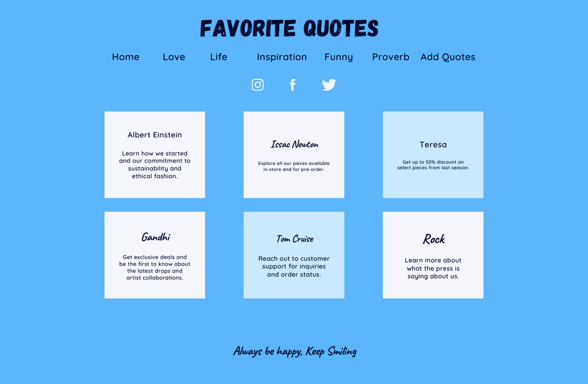

# FavoriteQuote
### It is a webapp where I can add my favorite quotes.
### It will be a full stack project.
### For project management and to maximize my efficiency. I will be using kanban board an agile project management tool.
### For the Mockup Design I have used canva.

# My Mockup Design

### I will using HTML, CSS, JavaScript, React, Bootstrap for Frontend.
### I will use Java Programming Language & Spring Boot for REST API.
### I will be using JUnit to test my controller method.
### I will be using postman to test my Rest API.
### I will be using MYSQL Database.

### I will be Using Axios, a Javascript library, to communicate with backend.

